# Mini SOC Home Lab - AD Attack Chain Detection with Wazuh

   

A fully segmented Active Directory lab built to **detect a realistic attack chain** end-to-end, from a malicious Office macro to Kerberoasting and SMB exfiltration. The offensive side exists only to validate the defensive side: every attacker action is mapped to a **custom Wazuh detection rule**, tuned against real telemetry, and confirmed live.

Built as the practical core of my MSc dissertation *"SIEM Platform for Security Event Collection and Correlation"* (Cybersecurity, ULBS Sibiu).

---

## Contents

- [What this demonstrates](#what-this-demonstrates)
- [Architecture](#architecture)
- [Threat scenario - the attack chain](#threat-scenario---the-attack-chain)
- [Detection engineering](#detection-engineering)
- [Response playbooks](#response-playbooks)
- [Incident report](#incident-report)
- [Hardening & audit policy (GPO)](#hardening--audit-policy-gpo)
- [Network security - pfSense least-privilege](#network-security---pfsense-least-privilege)
- [Alerting](#alerting)
- [Validation & reproducibility](#validation--reproducibility)
- [Future work](#future-work)
- [Documentation](#documentation)

---

## What this demonstrates

- **Detection engineering** - writing, tuning, and validating SIEM rules against real event telemetry, not signatures copied from a blog.
- **MITRE ATT&CK mapping** - every rule tied to a technique and a specific Windows/Sysmon Event ID.
- **Windows / AD security** - Advanced Audit Policy, PowerShell Script Block Logging, Sysmon, Kerberos internals.
- **Network segmentation** - least-privilege firewall design with explicit default-deny.
- **Purple-team validation** - each detection reproducible on demand for live demonstration.

**Stack:** Wazuh 4.14, Sysmon, pfSense 2.7.2, Windows Server 2022 (AD/DNS), Windows 11, Ubuntu Server, Slack alerting, VirtualBox

---

## Architecture

Three isolated segments behind pfSense, with the SOC network separated from the corporate network so agents push telemetry one way and analysts are never on the same broadcast domain as the assets they monitor.

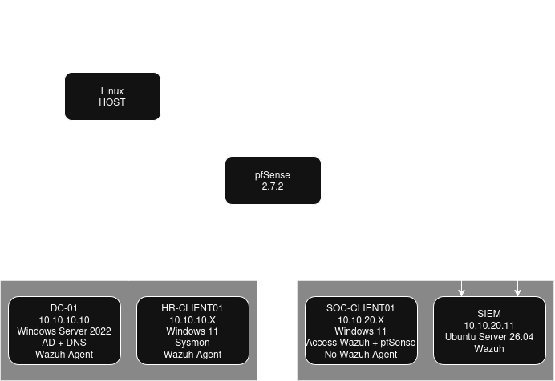

| Host | IP | Segment | Role | Telemetry |
|------|----|---------|------|-----------|
| DC-01 | 10.10.10.10 | CORP | Domain Controller, DNS (`aztek.com`) | Wazuh agent, `domain-controllers` group |
| HR-CLIENT01 | 10.10.10.11 | CORP | Workstation - initial foothold | Wazuh agent, `windows-workstations` group, Sysmon + PowerShell via `agent.conf` |
| SOC-CLIENT01 | 10.10.20.x | SOC | Analyst station - web access to Wazuh + pfSense | none (nothing to monitor; out of scope by design) |
| SIEM | 10.10.20.11 | SOC | Wazuh 4.14 manager | - |

> **Scope note:** monitoring is deliberately focused on the CORP Windows/AD attack surface (DC-01, HR-CLIENT01). SOC-CLIENT01 is a management host and runs no agent - keeping the detection scope tight on the assets the attack chain actually touches.

**Active Directory:** domain `aztek.com`; OUs `HR / PAYROLL / SOC`; kerberoastable service account `svc-payroll` (SPN `HTTP/payroll.aztek.com`); access to `\\DC-01\Payroll\salaries.xlsx` granted through an AGDLP group (`Payroll-Access`).

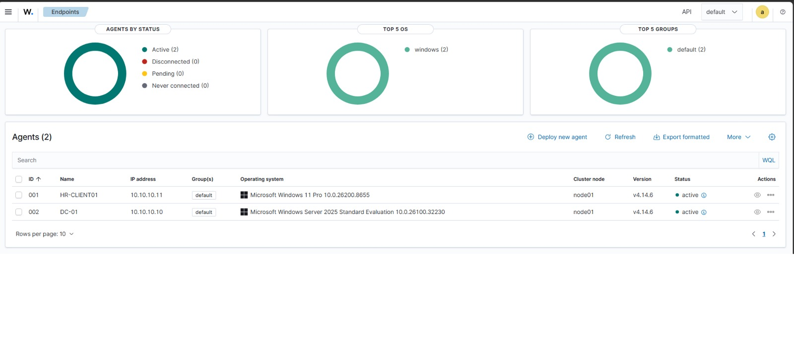

---

## Threat scenario - the attack chain

A six-phase intrusion simulating a payroll-data theft, used purely to generate the telemetry the detections fire on. Full step-by-step walkthrough is in [`docs/linux.pdf`](docs/linux.pdf); the captures below show the key moments.

| # | Phase | Technique (MITRE ATT&CK) |
|---|-------|--------------------------|
| 1 | Malicious Word macro -> Meterpreter C2 over 443 | T1566.001, T1204.002, T1059.001 |
| 2 | PowerView domain recon (`Get-DomainUser`, `Get-NetShare`, `Get-NetUser -SPN`) | T1087.002, T1069.002, T1135 |
| 3 | Kerberoasting `svc-payroll` with Rubeus (RC4 ticket) | **T1558.003** |
| 4 | Offline hash cracking with Hashcat | T1110.002 |
| 5 | SMB lateral movement with cracked credentials (`net use`) | T1078.002, T1021.002 |
| 6 | Exfiltration of `salaries.xlsx` from the network share | T1039 |

**Phase 1 - Meterpreter session established, then migrated to a stable host process:**

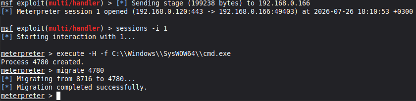

**Phase 2 - PowerView recon finds the SPN (`svc-payroll`) and the Payroll share:**

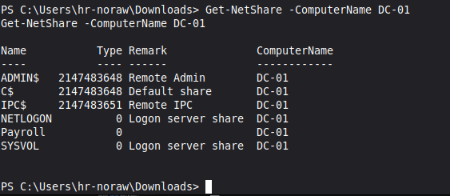

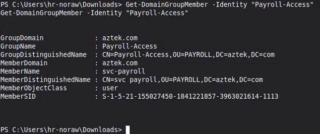

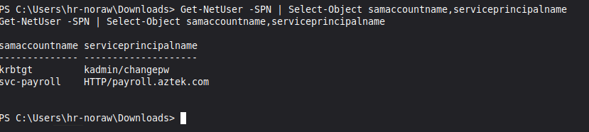

**Phase 3 - Rubeus requests the RC4 service ticket and writes the hash:**

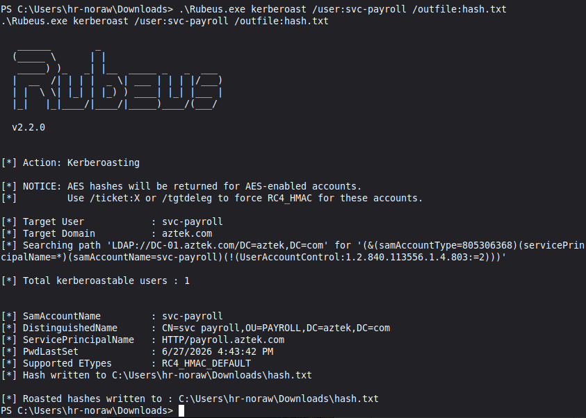

**Phase 4 - Hashcat cracks the service-account password offline:**

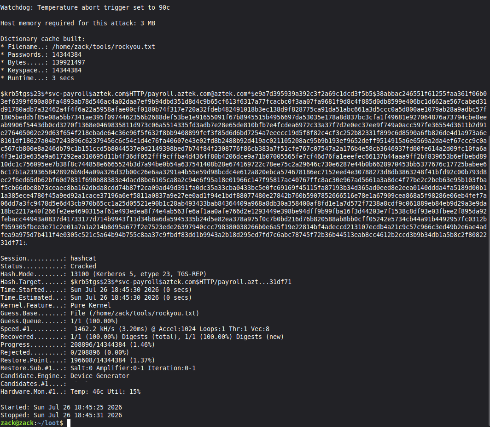

**Phase 5-6 - Authenticated SMB access to the share and exfiltration of `salaries.xlsx`:**

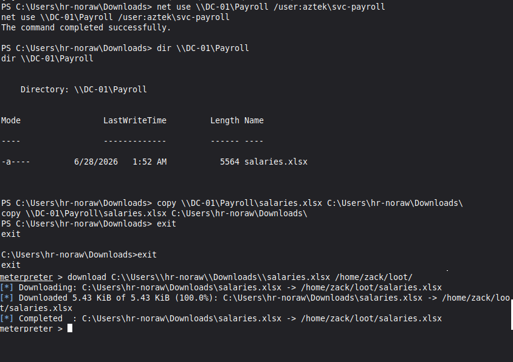

---

## Detection engineering

Four custom Wazuh rules in `/var/ossec/etc/rules/local_rules.xml`, all **level 12**. Each was built from a real event captured in Wazuh Discover: `full_log` -> `wazuh-logtest` -> rule -> live test. All four validated live and reproducible on demand.

### Detection coverage

Each attack phase mapped to its telemetry, rule, and alert. Gaps are marked deliberately.

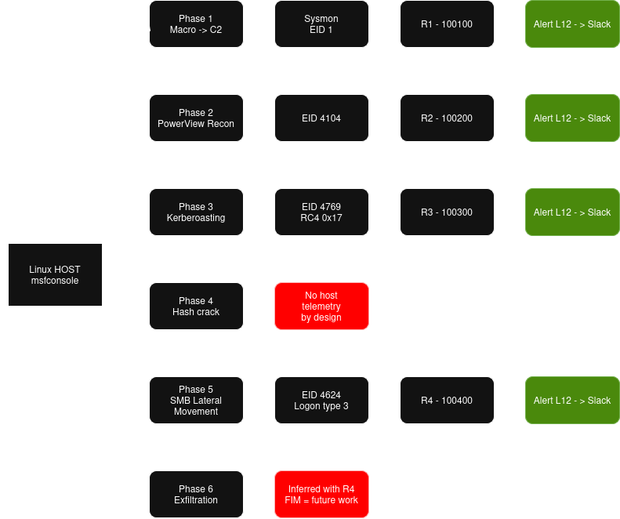

| Rule | ID | Fires on | Detects phase | MITRE |
|------|----|----------|---------------|-------|
| **R1** | 100100 | Sysmon **EID 1** - `parentImage` = WINWORD/EXCEL/POWERPNT spawning `cmd`/`powershell`/`wscript` | 1 - macro execution | T1566.001, T1059.001 |
| **R2** | 100200 | PowerShell **EID 4104** - `scriptBlockText` matches PowerView cmdlets (PCRE2) | 2 - recon | T1059.001, T1087.002 |
| **R3** | 100300 | Kerberos **EID 4769** - `serviceName=svc-payroll`, `ticketEncryptionType=0x17`, `status=0x0` | 3 - Kerberoasting | T1558.003 |
| **R4** | 100400 | Logon **EID 4624** - `targetUserName=svc-payroll`, `logonType=3` | 5 - SMB lateral movement | T1021.002, T1078.002 |

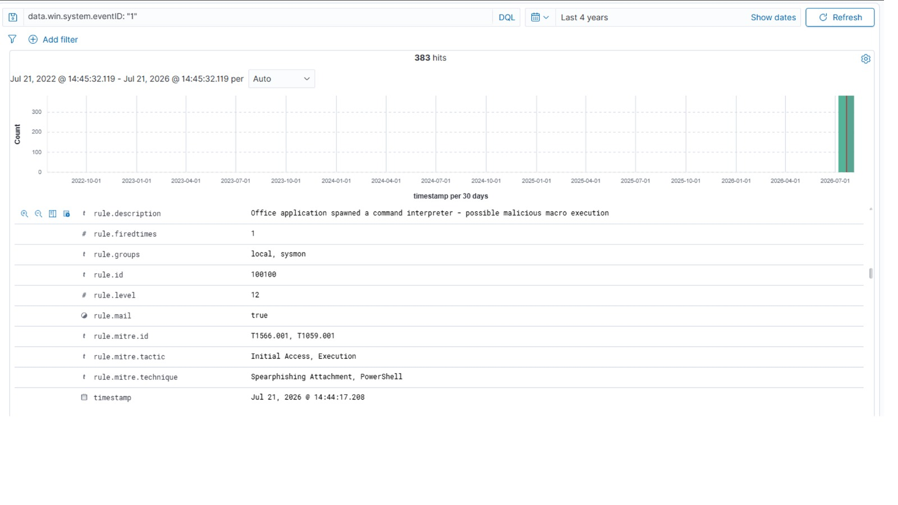

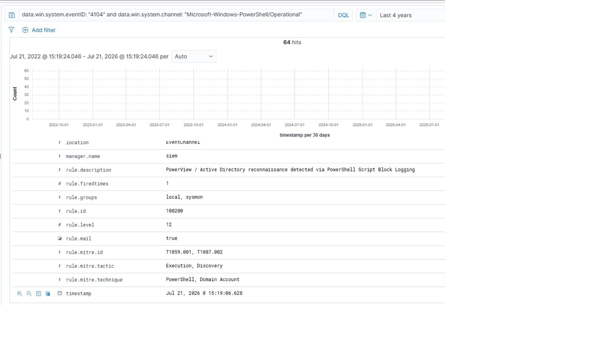

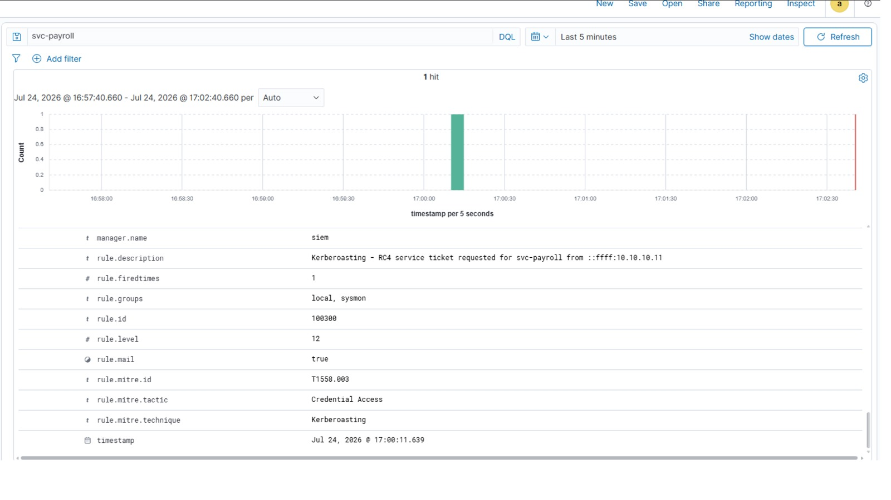

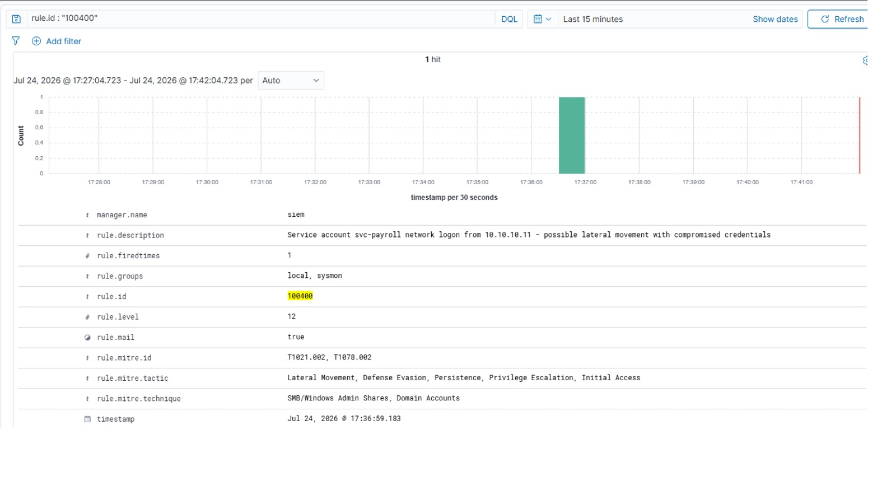

**Coverage and gaps (by design):**
- **Phase 4 (offline cracking)** produces no host telemetry - an intentional detection gap. The defensive answer is *prevention*, enforced here via the password policy (14-char minimum), which raises the cracking cost against a captured RC4 hash.
- **Phase 6 (exfil)** is currently inferred from R4 (the SMB session). File-level FIM / egress monitoring is noted as future work.

### Rule notes

- **R1** keys on the parent-child process relationship rather than a payload signature, so it catches any Office-spawned interpreter regardless of the specific macro.
- **R2** relies on Script Block Logging (EID 4104), enabled by GPO, and matches on cmdlet names via PCRE2 - resilient to variable/whitespace obfuscation that a plain string match would miss.
- **R3** is the highest-value detection: RC4 (`0x17`) service-ticket requests for a service account are a strong Kerberoasting signal. This rule triggers the Slack alert.
- **R4** detects *new logon-session establishment*, not per-file access - re-authenticating inside an existing interactive session reuses the SMB session and correctly does **not** re-fire. A fresh logon session is required to trigger it again.

### Response playbooks

Each detection has a full SOC response playbook - triage, investigation, containment, remediation, IOCs, and an event timeline with timestamps:

| Playbook | Covers |
|----------|--------|
| [R1 - Office macro](docs/playbooks/R1-office-macro.md) | Office spawning a command interpreter (initial access) |
| [R2 - PowerView recon](docs/playbooks/R2-powerview-recon.md) | Domain enumeration via PowerShell |
| [R3 - Kerberoasting](docs/playbooks/R3-kerberoasting.md) | RC4 service-ticket request for `svc-payroll` |
| [R4 - Lateral movement](docs/playbooks/R4-lateral-movement.md) | Service-account network logon / SMB access |

## Hardening & audit policy (GPO)

Three custom GPOs make the telemetry above exist in the first place:

- **SOC - DC Audit Policy** (Domain Controllers OU) - Kerberos Service Ticket Operations -> Success; Audit Logon -> Success. Plus `auditpol` for Kerberos Authentication Service + Credential Validation -> Success/Failure.
- **SOC - PowerShell Logging** (HR OU) - Script Block Logging + Module Logging -> Enabled (EID 4104).
- **SOC - Account Policies** (domain root) - password history 24, max age 90d, min length 14, complexity on; lockout after 5 attempts, 15-min duration/reset.

> **Debugging note:** DC-side user logons initially weren't captured - only machine-account (`$`) events flowed. Root cause was Windows audit subcategories (`Credential Validation` / `Kerberos Authentication Service` = *No Auditing*), **not** Wazuh. Enabling them via `auditpol` + manager restart resolved it. A reminder that SIEM coverage is only as good as the source audit policy.

---

## Network security - pfSense least-privilege

Explicit allow rules per segment, ending in default deny. No pass-all.

**Firewall Aliases**

Hosts: `DC-01 = 10.10.10.10`, `WAZUH = 10.10.20.11`

Ports: `AD_PORTS = 53, 88, 389, 445, 636` | `WAZUH_PORTS = 1514, 1515` | `WEB_PORTS = 80, 443`

**CORP (em1)**
| # | Action | Protocol | Source | Destination | Port | Description |
|---|--------|----------|--------|-------------|------|-------------|
| 1 | Pass | UDP | CORP subnets | any | 53 | DNS |
| 2 | Pass | TCP/UDP | CORP subnets | DC_01 | AD_PORTS | AD: DNS, Kerberos, LDAP, SMB, LDAPS |
| 3 | Pass | TCP | CORP subnets | WAZUH | WAZUH_PORTS | Agents -> Wazuh |
| 4 | Pass | UDP | CORP subnets | 10.10.10.1 | 123 | NTP |
| 5 | Pass | TCP | CORP subnets | any | WEB_PORTS | Internet |
| 6 | Block | TCP | CORP subnets | WAZUH | 443 | Block Wazuh Dashboard |
| 7 | Block | * | CORP subnets | * | * | Default deny |

**SOC (em2)**
| # | Action | Protocol | Source | Destination | Port | Description |
|---|--------|----------|--------|-------------|------|-------------|
| 1 | Pass | UDP | SOC subnets | any | 53 | DNS |
| 2 | Pass | TCP | SOC subnets | any | WEB_PORTS | Slack, updates |
| 3 | Pass | UDP | SOC subnets | 10.10.20.1 | 123 | NTP |
| 4 | Block | * | SOC subnets | * | * | Default deny |

NTP is centralized on pfSense so event timestamps stay correlated across hosts.

---

## Alerting

Slack webhook integrated in `ossec.conf` (`level >= 12`). All four detections confirmed firing to the SOC channel.

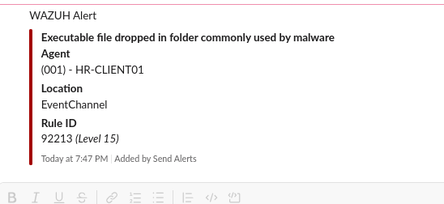

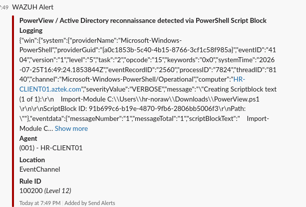

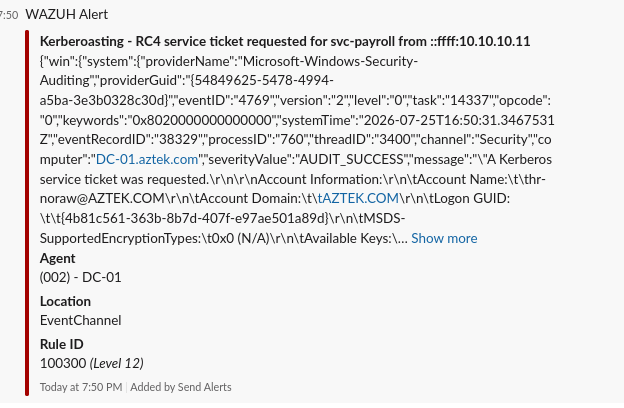

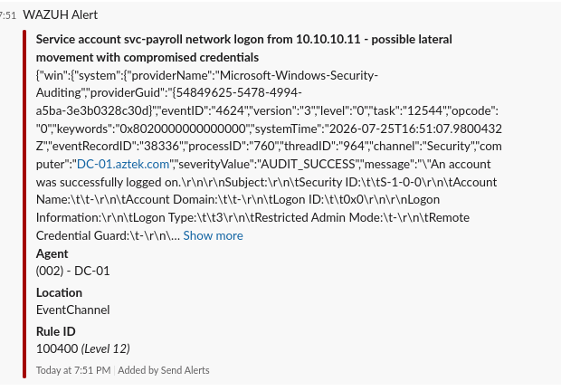

---

## Validation & reproducibility

Every rule is validated live and re-triggerable on demand - useful for a walkthrough or interview demo:

| Rule | Re-trigger |
|------|-----------|
| R1 | Open the macro document + Meterpreter `migrate` |
| R2 | Load PowerView + `Get-DomainUser` |
| R3 | `klist purge`, then request the service ticket (purge forces a fresh 4769) |
| R4 | New HR logon session (logoff/logon or `runas`), then `net use` |

---

## Future work

This is a functional v1. Planned next iterations, in priority order:

- **File Integrity Monitoring (FIM)** on the Payroll share to close the Phase 6 exfiltration gap directly, rather than inferring it from R4.
- **Ticketing integration** (TheHive / Jira) so a level-12 alert opens a case automatically - modelling real SOC triage flow.
- **Egress / network detection** (Suricata on pfSense) to catch C2 beaconing at the network layer, complementing host telemetry.
- **Detection-as-code** - version the rules with a CI check (`wazuh-logtest` in a pipeline) so every rule change is validated before deploy.

---

## Documentation

Full step-by-step build documentation lives in `/docs/guide`. The README is the overview; these are the steps.

[Full step-by-step guide](docs/guide/Mini-SOC-Home-Lab_Guide.pdf)

---

## Author

**Tolbaru Constantin Sorin** - MSc Cybersecurity, ULBS Sibiu, CompTIA Security+
Targeting Junior SOC / Security Analyst roles.